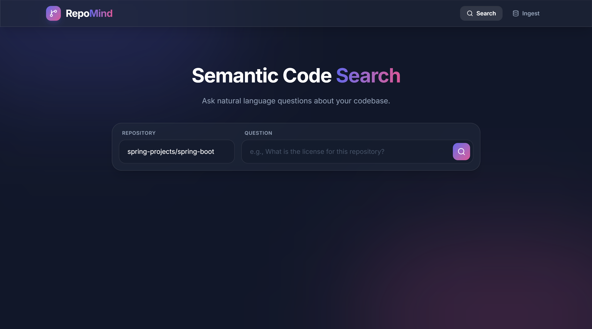
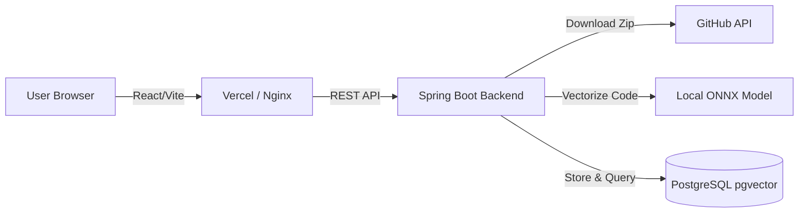

# 🧠 RepoMind: AI-Powered Semantic Code Search

RepoMind is a full-stack, AI-powered search engine that allows you to ingest any public GitHub repository and instantly query its codebase using natural language. 

Instead of traditional keyword matching, RepoMind uses **Local ONNX Machine Learning Models** to generate 384-dimensional mathematical representations (embeddings) of code snippets. These embeddings are stored and queried using **PostgreSQL pgvector**, enabling blazing-fast, highly accurate semantic search capabilities.



---

## ✨ Features

- **🧠 100% Local AI Embeddings**: Uses Deep Java Library (DJL) and ONNX Runtime to compute embeddings entirely locally. No OpenAI API keys, no usage limits, no cloud inference costs!
- **⚡ Lightning Fast Vector Search**: Leverages PostgreSQL `pgvector` for efficient nearest-neighbor semantic search (Cosine Similarity).
- **🎨 Modern React Frontend**: A beautiful, glassmorphic UI built with Vite, React Router, and the brand-new Tailwind CSS v4.
- **🐳 Microservices Architecture**: Fully decoupled Frontend and Backend, both optimized with multi-stage Docker builds.
- **🚀 CI/CD Ready**: Includes GitHub Actions workflows designed for automated deployments to AWS ECR and Vercel.

---

## 🏗️ Architecture



---

## 🛠️ Tech Stack

### Backend
- **Java 17 & Spring Boot 3**
- **Spring AI**: Abstracts AI model interactions.
- **DJL & ONNX Runtime**: Executes the `all-MiniLM-L6-v2` embedding model locally.
- **PostgreSQL 16**: Database storage.
- **pgvector**: Postgres extension for vector similarity search.

### Frontend
- **React 18 & Vite**: Blazing fast frontend tooling.
- **Tailwind CSS v4**: Utility-first CSS framework for modern styling.
- **React Router DOM**: Client-side SPA routing.
- **Nginx**: Production web server for Docker environments.

---

## 🚀 Quickstart (Docker)

You can run the entire stack locally using Docker.

### 1. Start the Database
Spin up the PostgreSQL database equipped with the `pgvector` extension.
```bash
docker-compose up -d
```

### 2. Build and Run the Backend
The backend utilizes a multi-stage Docker build. *Note: The first build will take a few minutes as it caches Maven and Machine Learning dependencies.*
```bash
cd backend
docker build -t repomind-backend .
docker run -d --name repomind-backend-app -p 8080:8080 \
  -e SPRING_DATASOURCE_URL=jdbc:postgresql://host.docker.internal:5432/repomind \
  repomind-backend
```

### 3. Build and Run the Frontend
The frontend builds the Vite app and serves it natively via an Alpine Nginx container.
```bash
cd ../frontend
docker build -t repomind-frontend .
docker run -d --name repomind-frontend-app -p 80:80 repomind-frontend
```

### 4. Search!
Open your browser and navigate to `http://localhost`. 
1. Go to the **Ingest** tab and enter a GitHub repository (e.g., `spring-projects/spring-boot`).
2. Wait for the codebase to be vectorized.
3. Go to the **Search** tab and ask a natural language question about the code!

---

## 📦 CI/CD Pipeline

RepoMind is configured for automated deployments:
- **Backend**: Pushes to the `main` branch trigger a GitHub Action that builds the Spring Boot application, packages the Docker image, and pushes it to **Amazon ECR**.
- **Frontend**: The React application is configured to deploy automatically via **Vercel's** native GitHub integration.

## 📄 License
This project is licensed under the MIT License.
